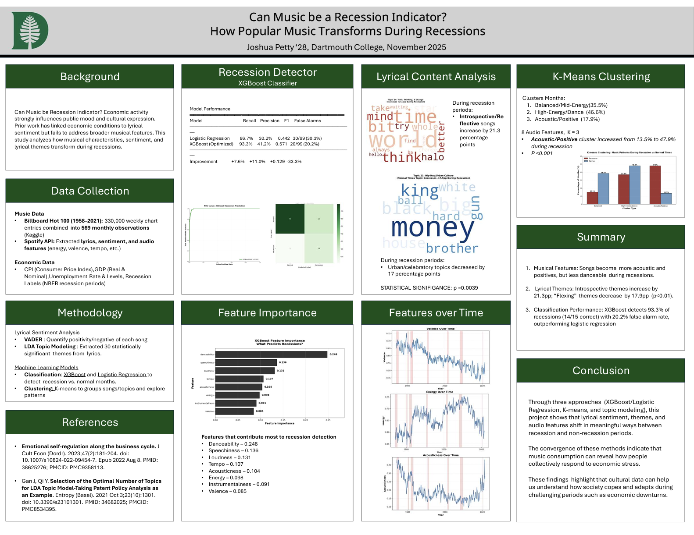
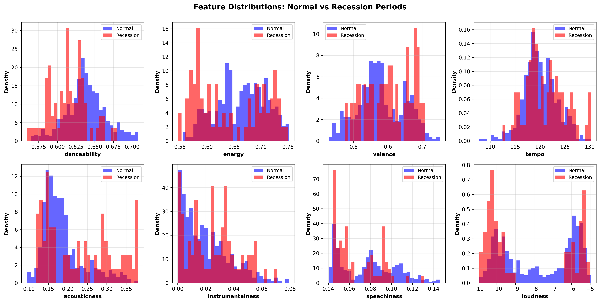
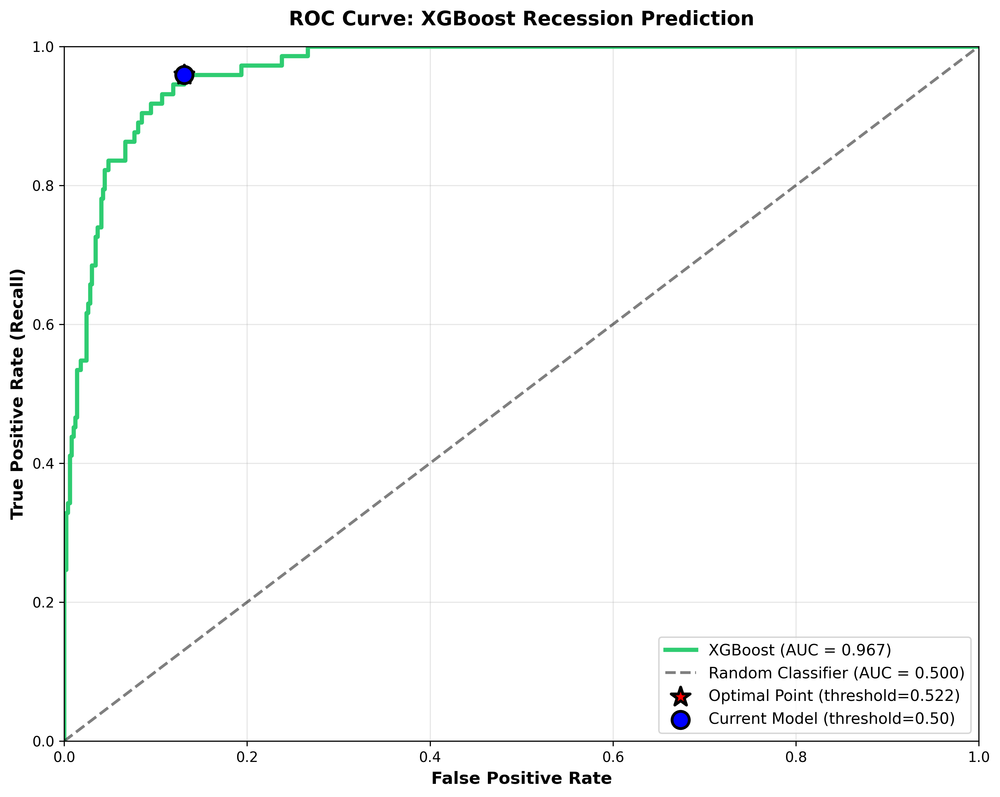

# Can Music be a Recession Indicator?
**How Popular Music Transforms During Economic Downturns**
*Joshua Petty ’28, Dartmouth College | November 2025*

---

## Overview
This project investigates whether economic activity influences public mood and cultural expression through music. While prior work has linked economic conditions to lyrical sentiment, this study expands that scope to analyze how broader musical characteristics, sentiment, and lyrical themes transform during US recessions.

## Project Poster
*Full project overview and visual breakdown of findings.*

---

## Key Findings

### 1. Musical Feature Shifts
Statistical analysis shows a clear shift in the sonic profile of popular music during economic downturns:
* **Acoustic and Positive**: Songs become significantly more acoustic and exhibit higher valence (positivity) during recessions.
* **Lower Energy**: There is a notable decrease in danceability and high-energy tracks.
* **Cluster Trends**: Using K-Means clustering ($K=3$), the **Acoustic/Positive** cluster was found to increase from **13.5% to 47.9%** during recession periods ($P < 0.001$).

### 2. Lyrical Content Transformation
Through LDA Topic Modeling (30 themes), significant shifts in lyrical content were identified:
* **Introspection**: Introspective/Reflective themes increase by **21.3 percentage points**.
* **Flex Culture**: Urban/Celebratory (Flexing) themes decrease by **17.9 percentage points** ($p < 0.01$).

### 3. Classification Performance
The optimized **XGBoost** model proved highly effective at detecting economic states based on musical data:
* **Detection Rate**: 93.3% of recessions detected (14/15 correct).
* **Accuracy**: The model outperformed Logistic Regression with a lower false alarm rate of **20.2%**.

---

## Methodology

### Data Collection
* **Music Data**: 330,000 weekly **Billboard Hot 100** entries (1958–2021) aggregated into 569 monthly observations.
* **Features**: Audio features (energy, tempo, valence) and lyrics extracted via the **Spotify API**.
* **Economic Data**: CPI, GDP (Real and Nominal), Unemployment Rate, and NBER Recession Labels.

### Model Feature Importance
According to the XGBoost model, the top predictors for a recession include:
1. **Danceability** (0.248)
2. **Speechiness** (0.136)
3. **Loudness** (0.131)
4. **Tempo** (0.107)

---

## Visual Analysis
### Feature Trends Over Time

### Model Performance

---

## Conclusion
Through the convergence of XGBoost/Logistic Regression, K-means, and topic modeling, this project demonstrates that lyrical sentiment, themes, and audio features shift in meaningful ways between recession and non-recession periods. 

The convergence of these methods indicates that music consumption can reveal how people collectively respond to economic stress. These findings highlight that cultural data can help us understand how society copes and adapts during challenging periods such as economic downturns.

---

## References
* Emotional self-regulation along the business cycle. J Cult Econ (Dordr). 2023;47(2):181-204.
* Gan J, Qi Y. Selection of the Optimal Number of Topics for LDA Topic Model-Taking Patent Policy Analysis as an Example. Entropy (Basel). 2021 Oct 3;23(10):1301.